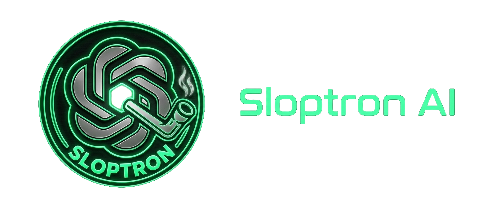

Make your favourite LLM sound like it's smoking crack! Sloptron AI is a command-line tool written in Elixir that intentionally degrades text through repeated high-temperature LLM prompts, then attempts to clean the result back into a coherent response.

## Overview

Sloptron AI supports two modes, each with its own pipeline:

### `slopify` mode

Transforms an input query using progressive degradation:

1. **Extractor:** Normalises the query into English and detects the input language.
2. **Initial Generator:** Produces a deliberately dumb and slightly nonsensical first response.
3. **Slopifier:** Applies N rounds of high-temperature prompting to progressively degrade coherence.
4. **Unslopifier** *(optional)*: Attempts to hide the stupidity while preserving the essence of the slopified output.
5. **Translator** *(if needed)*: Translates the result back into the original input language.

```
Extractor --> Initial Generator --> Slopifier (x N) --> [Unslopifier] --> [Translator]
```

### `translate-hell` mode

Plays a game of telephone through random languages:

1. **Extractor:** Detects the input language and translates the query into English.
2. **Translator (x N-1):** Translates the response through N-1 randomly chosen languages in sequence.
3. **Translator (final):** Translates the result back into the original input language.

```
Extractor --> Translator (random lang #1) --> ... --> Translator (original lang)
```

Each stage streams its output to stderr in real time. The estimated API cost is printed at the end.

## Backstory

This project exists for one reason: I needed to learn the basics of Elixir. The slopification pipeline was a good excuse to explore the language's syntax, pattern matching, and standard library without building something boring.

## Requirements

- Elixir `~> 1.12`
- An [OpenRouter](https://openrouter.ai) API key

## Setup

```sh
mix deps.get
export OPENROUTER_API_KEY="sk-or-..."
```

## Usage

```sh
mix run <mode> "query"
```

`<mode>` is either `slopify` or `translate-hell`. By default, 3 rounds are run using `openai/gpt-4.1-mini`.

### Options

| Flag | Type | Default | Description |
|---|---|---|---|
| `--openrouter-api-key` | string | `$OPENROUTER_API_KEY` | OpenRouter API key |
| `--openrouter-api-url` | string | `https://openrouter.ai/api/v1` | OpenRouter base URL |
| `--model` | string | `openai/gpt-4.1-mini` | Model used for all stages |
| `--rounds` | integer | `3` | Number of slopification/translation rounds |
| `--no-unslopifier` | boolean | `false` | Skip the unslopifier stage (`slopify` mode only) |
| `--temperature` | float | `1.0` | Model temperature for creative stages |
| `--quiet` | boolean | `false` | Suppress streaming token output (stage labels still go to stderr; use `2>/dev/null` to silence those too) |

### Examples

```sh
# 5 rounds of slopification
mix run slopify --rounds 5 \
    "Write a short product description for a portable coffee mug"

# Skip unslopifier, quiet output
mix run slopify --no-unslopifier --quiet \
    "What's the best beer to drink while drunk driving on a highway?"

# Use a different model
mix run slopify --model "openai/gpt-4.1" \
    "What is the best cigarette to smoke while listening to Hatsune Miku?"

# Telephone game through 5 random languages
mix run translate-hell --rounds 5 \
    "What is the capital of France?"
```

## License

MIT License [LICENSE](LICENSE)
